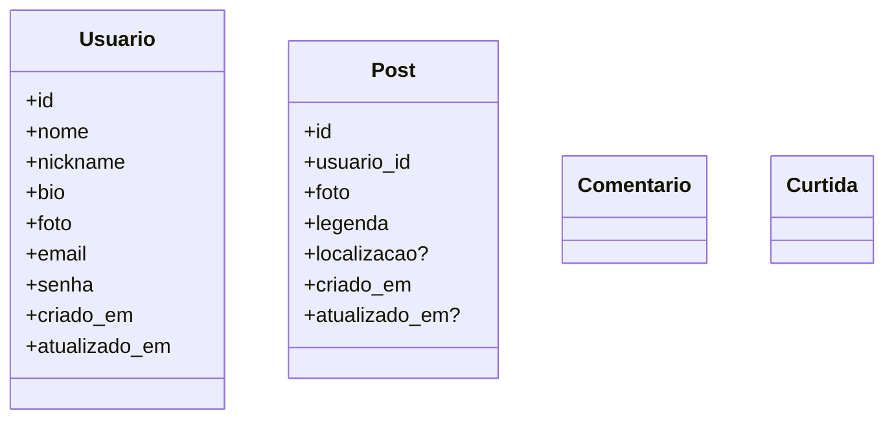

#API do INSTAGRAM

## Tecnologias
-NodeJS
-ExpressJS
-MySQL

### Recursos
-Usuarios
-Post
-Comentarios
-Curtidas

### Estrutura do Dados

https://mermaid.live

```mermaid
classDiagram
    class Usuario{
        +id
        +nome
        +nickname
        +bio
        +foto
        +email
        +senha
        +criado_em
        +atualizado_em
    }
    class Post{
        +id
        +usuario_id
        +foto
        +legenda
        +localizacao?
        +criado_em
        +atualizado_em?
    }
    class Comentario{

    }
    class Curtida{

    }


```